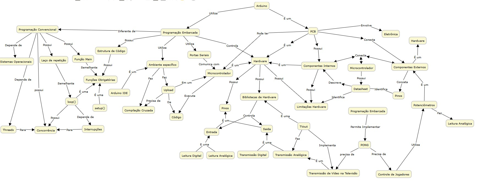
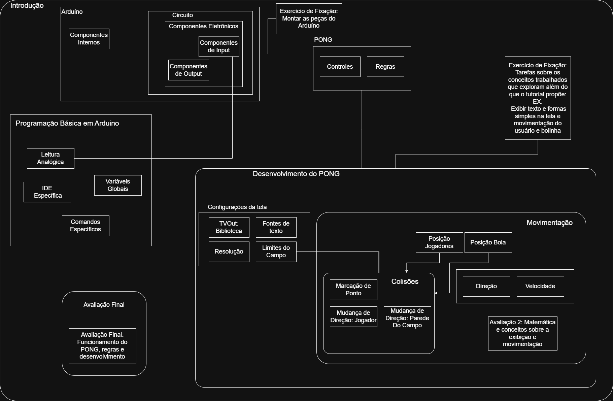

## Repositório da matéria de objetos de aprendizagem - OPT016 -  Confecção de um objeto de aprendizagem para ensinar um jogo do PONG com arduíno

# 🕹️ Objeto de Aprendizagem: Jogo Pong com Arduino
## 🎯 Descrição Geral

Este objeto de aprendizagem tem como objetivo introduzir conceitos fundamentais de programação embarcada, interação com hardware e lógica de jogos utilizando o Arduino como plataforma.
O jogo desenvolvido é uma versão simplificada do clássico Pong, onde os jogadores controlam raquetes para rebater a bola exibida em uma televisão.

O público-alvo são estudantes iniciantes em cursos de graduação em tecnologia ou engenharia, que já possuam conhecimentos básicos em linguagem C e desejem compreender, de forma prática e lúdica, o funcionamento de sistemas embarcados.

## 🎓 Requisitos de Aprendizagem

Ao final desta atividade, espera-se que o estudante seja capaz de:

* Compreender o funcionamento básico do Arduino e sua arquitetura (pinos digitais, analógicos e temporização).

* Implementar estruturas de controle em C (condicionais, laços e funções) aplicadas em um ambiente embarcado.

* Manipular entradas e saídas analógicos e digitais (potenciômetros e botões).

* Aplicar lógica de movimentação e colisão em um contexto de jogo simples.

* Relacionar conceitos de programação com aspectos físicos do hardware (entrada, processamento e saída).

* Integrar componentes eletrônicos (potenciômetros, botões, buzzer, etc.) para enriquecer a experiência interativa.

## 🧩 Conteúdos Envolvidos

* Estrutura de um programa Arduino (setup() e loop())

* Controle de tempo (delay() e millis())

* Manipulação de pinos digitais (digitalRead() / digitalWrite())

* Displays gráficos

* Conceitos de lógica de jogo: colisão, pontuação e movimentação

* Modularização de código com funções em C

## 🔧 Materiais Necessários

* Placa Arduino Uno (ou compatível)

* Botões ou potenciômetros

* Jumpers e protoboard

* Cabo USB para upload do código

## 🧠 Metodologia Sugerida

* Introdução (conceitos de Arduino, entradas/saídas digitais e tempo de execução)

* Análise do código-base (identificar funções principais e fluxo lógico)

* Implementação guiada (compilar, testar e ajustar o comportamento)

* Experimentação livre (alterar parâmetros, adicionar efeitos ou novos desafios)

* Reflexão e discussão sobre o que foi aprendido

## 🧾 Avaliação da Aprendizagem

O aprendizado pode ser avaliado por meio de:

* Questionário sobre conceitos de hardware e lógica de programação.

* Avaliação teórica sobre conceitos matemáticos de movientação e colisão

* Entrega e demonstração do código funcional.

## Mapa Conceitual

## Modelo Instrucional

👨‍💻 Autores

Pedro Grigolli
Hugo Okumura

🏫 Licença e Uso Educacional

Este objeto de aprendizagem possui licença MIT
